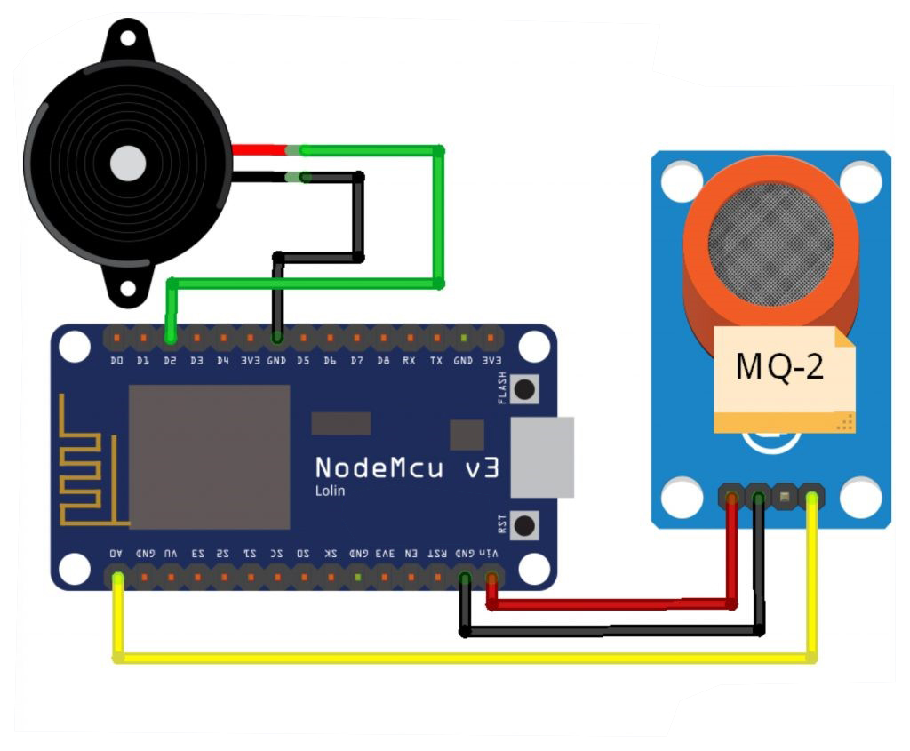
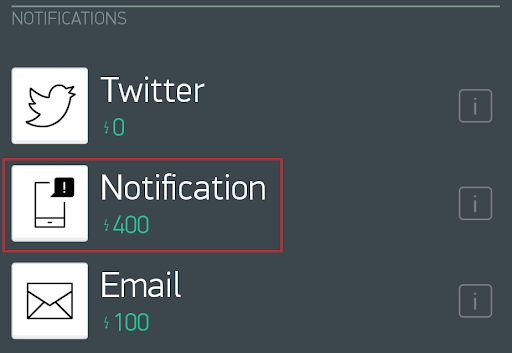

# BLYNK IoT Gas Leak Detector Using NodeMCU ESP8266 v3 Lolin

## Description

- MQ-2 is a sensor used to detect the concentration of flammable gases in the air and smoke and the output reads as an analog voltage. The MQ-2 smoke gas sensor can be directly adjusted for sensitivity by rotating its trimpot. This sensor is commonly used to detect gas leaks both at home and in industry. Gases that can be detected include: LPG, isobutane, propane, methane, alcohol, hydrogen, smoke. If this MQ-2 sensor is connected to an IoT device, the information obtained can be processed and displayed anywhere.

## Circuit Schematic

- Below you can see a schematic image to facilitate the wiring of cables from the microcontroller to devices, both input and output sensors:



## Component (Tools & Materials):

- NodeMCU ESP8266 v3 Lolin = 1 unit;
- MQ-2 Sensor = 1 unit;
- Piezo Buzzer = 1 unit;
- BreadBoard / ProjectBoard = 1 unit;
- Wired.

## Sketch Code Program

```cpp
#define BLYNK_PRINT Serial
#include <ESP8266WiFi.h>
#include <BlynkSimpleEsp8266.h>

char auth[] ="XXXX";                // masukkan kode autentikasi disini
char ssid[] = "Veendy-Suseno";      //nama wifi
char pass[] = "Admin12345";         //password

int buzzer = D2;
int smokeA0 = A0;
int sensorThres = 600;

void setup() {
    pinMode(buzzer, OUTPUT);
    pinMode(smokeA0, INPUT);
    Serial.begin(9600);
    Blynk.begin(auth, ssid, pass);
    }

void loop() {
    int analogSensor = analogRead(smokeA0);
    Serial.print("Pin A0: ");
    Serial.println(analogSensor);
    if (analogSensor > sensorThres)
    {
        tone(buzzer, 1000, 200);
        Blynk.notify("Alert: Fire in the House");
    }
    else
    {
        noTone(buzzer);
    }
    delay(100);
    Blynk.run();
}

```

## Blynk Settings:

- Use Notification type Widget Box : <br/>
   <br/>
- Image to Widget Box Notification

## Interface:

 <br/>

- Image to Interface BLYNK IoT Gas Leak Detector Using NodeMCU ESP8266 v3 Lolin

## Conclusion:

- In this project the MQ-2 sensor is connected to NodeMCU to detect flammable gas in a room. If there is a flammable gas in a room where there is an MQ-2 sensor, the sensor will provide an output which will be read by the NodeMCU which will then make a buzzer sound and will provide a notification on the Blynk Application.
